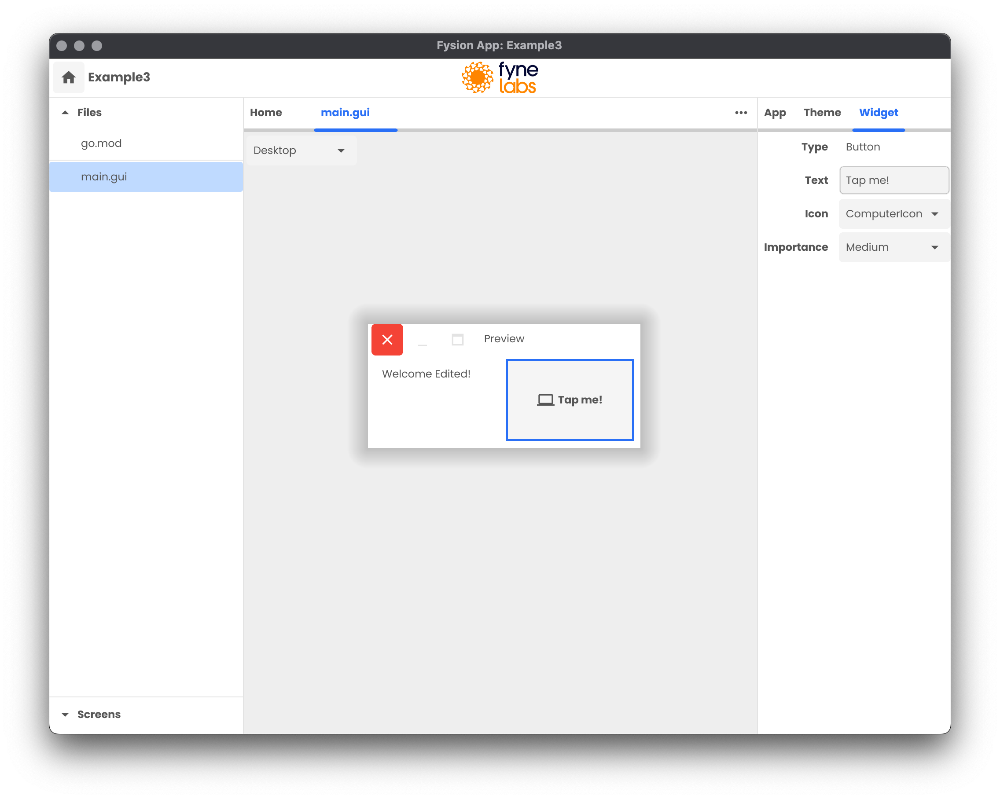

# Fysion Tutorials

This repository contains the code accompanying our video series "Creating an App Builder"
https://www.youtube.com/watch?v=tYHD7OU9xfM&list=PLw-dEUf31ZOrcauGkrLWSSrJTAfMo_gMf&index=2

## Trying out the code

You can try out the code in this repo by simply calling `go run .`.
You will need to have the development tools required for Fyne - check https://developer.fyne.io/started/.

## Episodes

To check out the code from an old episode just `git checkout <tag>` where the tag is one of:

### Series 1:

* **ep10**: Editing Widgets and Layouts
* **ep9**: Project Metadata and Recents Storage
* **ep8**: Editor State and File Save
* **ep7**: Theme Editor and Preview
* **ep6**: GUI Files and Unit Tests
* **ep5**: Opening Multiple Files
* **ep4**: File Tree and Editor Layout
* **ep3**: Project Creation Wizard
* **ep2**: Packaging and Folder Open
* **ep1**: Setup, layout and theme

## License

This work is dual-licensed under GPL 3.0 (or any later version) and the Fyne Labs Commercial license.
You may use the contents of this repository under the terms of the GPL 3.0 if you do not hold a commercial license.
Should you be the holder of a Fyne Labs commercial license then its terms superceed the GPL 3.0 usage.

`SPDX-License-Identifier: GPL-3.0-or-later OR LicenseRef-FyneLabsCommercial`

## Contributions

Contributions to this repository will be gratefully accepted from any individuals who agree to
license their work under the dual license listed above.
